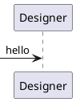

# Designer's Template with Visual Studio Code

What do you want to solve today?

## Introduction

This git repository is a compilation of tools I use to design apps

Main design involves the use of PlantUML. (https://plantuml.com)

## Start with Visual Studio Code

This toolset works with Visual Studio Code.

Install Visual Studio Code first.

Official link: https://code.visualstudio.com/

## Install extensions to support

Open this folder in Visual Studio code.

Enter 
```cmd
code .
```

Install recommended extensions for the workspace defined in
```
.\.vscode\extensions.json
```

Recommended Extensions section under the Extensions tab would list the following if not installed.

- `markdown-preview-enhanced`

  https://shd101wyy.github.io/markdown-preview-enhanced/#/
  This extension provides its own preview that helps exporting documents in html, pdf etc.
  Also embed PlantUML with local renderer

- `eamodio.gitlens`

  Git lens provides changes made for the document by headers.

- `jebbs.plantuml`

  Although `markdown-preview-enhanced` renders the content on MD, this extension helps exporting diagram on its own.
  Default to local renderer. If you use a server renderer (preferrably on LAN), you can have UML on VS markdown.

## PlantUML

https://shd101wyy.github.io/markdown-preview-enhanced/#/diagrams?id=plantuml

If the diagram is not rendered, check with the extension link above.
Likely you will need to have JAVA installed locally.

Also test with PlantUML extension, if installed, by moving the cursor inside the code block below at `@startuml` and hit `Alt+D`



Have fun designing!